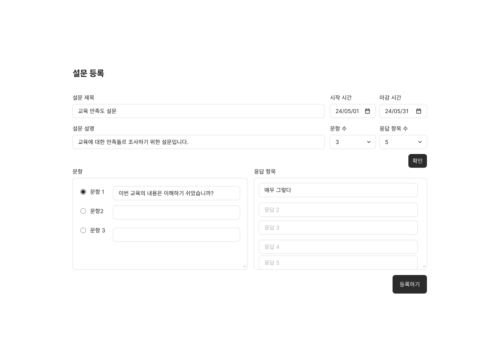
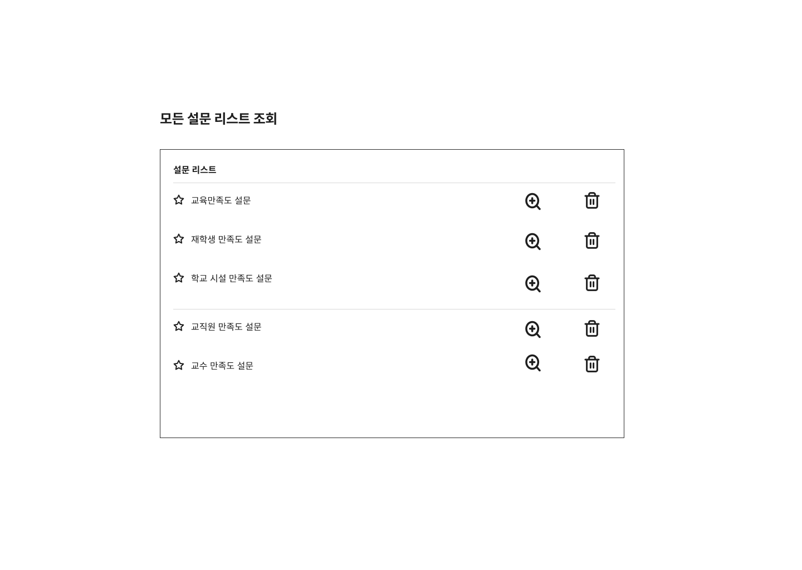
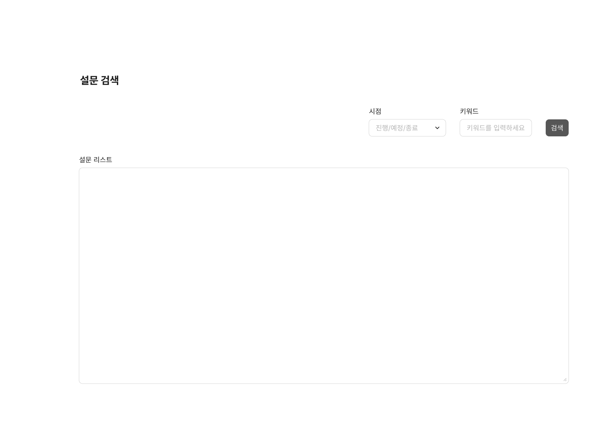
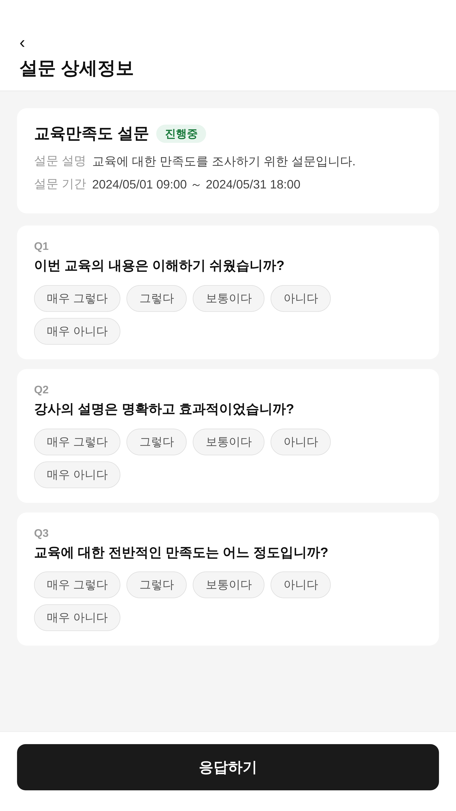
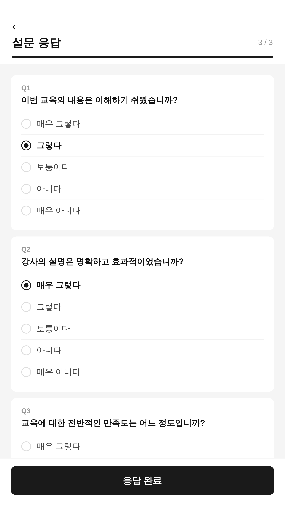
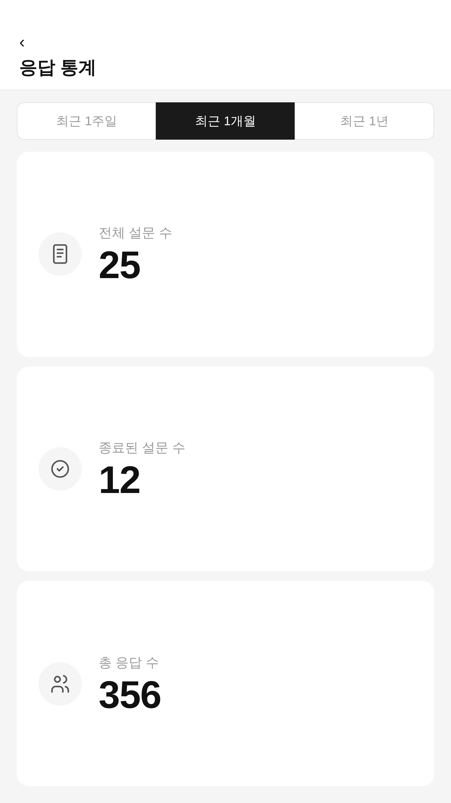

# Use Case에 대한 UI 화면

---

## UC-01 (회원가입)

### UI 화면

### 화면 이름
-회원 가입 ui

### 설명
-ID, 비밀번호, 이름, 전화번호, 이메일을 입력한 후 회원가입 버튼을 누른다.

---

## UC-02 (회원탈퇴)

### UI 화면

### 화면 이름
-회원 탈퇴 ui

### 설명
-회원 탈퇴에 관한 안내사항과, 회원 탈퇴 버튼이 있다.

---

## UC-03 (로그인)

### UI 화면

### 화면 이름
-로그인 폼

### 설명
-ID와 비밀번호를 입력해 로그인 한다.

---

## UC-04 (설문 등록)

### UI 화면

### 화면 이름
-설문 등록

### 설명
-새로운 설문을 등록한다.

---

## UC-05 (설문 조회)

### UI 화면

### 화면 이름
-설문 조회

### 설명
-모든 설문을 조회한다. 특정 설문의 상세정보를 조회하거나 삭제할 수 있다.

---

## UC-06 (설문 검색)

### UI 화면

### 화면 이름
-설문 검색

### 설명
-조건을 만족하는 설문을 검색한다.

---

## UC-07 (설문 상세정보 조회)

### UI 화면

### 화면 이름
-설문 상세정보 조회

### 설명
-선택한 특정 설문의 제목, 설명, 문항 및 응답 항목, 시작 및 마감 시각을 확인할 수 있으며, 진행 중인 설문에 한해 응답하기 버튼이 활성화된다.

---

## UC-08 (설문 응답)

### UI 화면

### 화면 이름
-설문 응답

### 설명
-각 문항에 응답을 선택하고, 모든 문항에 응답이 완료되면 응답 완료 버튼이 활성화되어 제출할 수 있다.

---

## UC-09 (설문 응답 통계 정보 조회)

### UI 화면

### 화면 이름
-설문 응답 통계 정보 조회

### 설명
-관리자가 조회 기간(1주일 / 1개월 / 1년)을 선택하면 해당 기간의 전체 설문 수, 종료된 설문 수, 총 응답 수를 확인할 수 있다.
