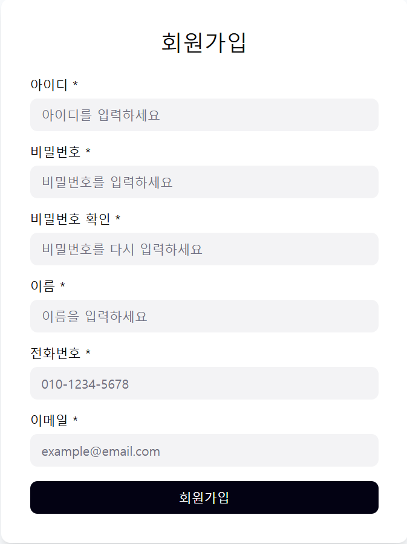
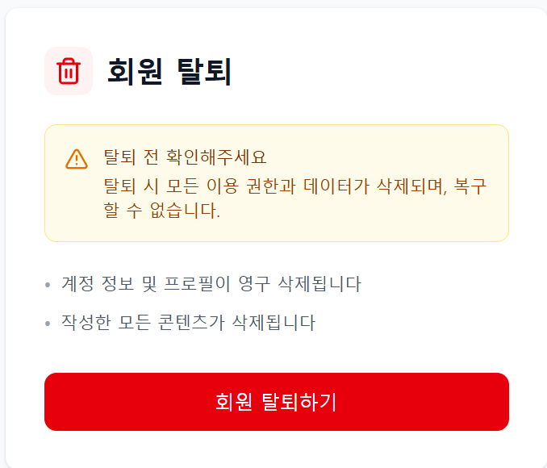
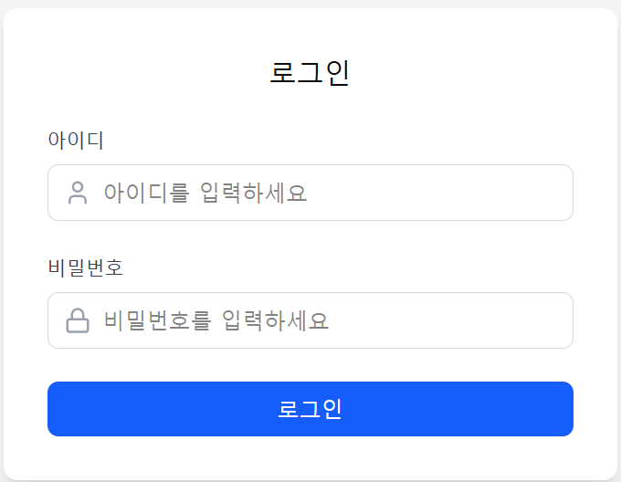

# Use Case에 대한 UI 화면

---

## UC-01 (use case 이름)

### UI 화면

### 화면 이름
-회원 가입 ui

### 설명
-ID, 비밀번호, 이름, 전화번호, 이메일을 입력한 후 회원가입 버튼을 누른다.

---

## UC-02 (use case 이름)

### UI 화면

### 화면 이름
-회원 탈퇴 ui

### 설명
-회원 탈퇴에 관한 안내사항과, 회원 탈퇴 버튼이 있다.

---

## UC-03 (use case 이름)

### UI 화면

### 화면 이름
-로그인 폼

### 설명
-ID와 비밀번호를 입력해 로그인 한다.