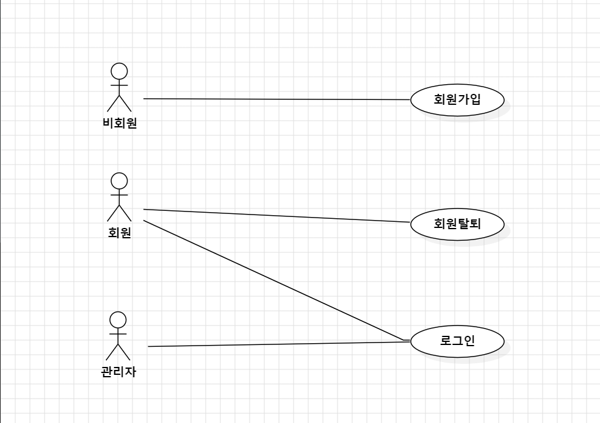
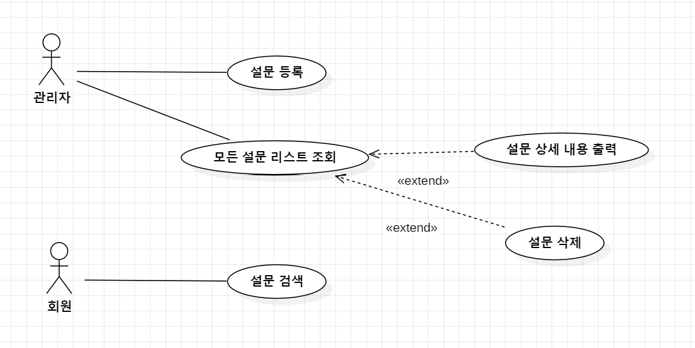
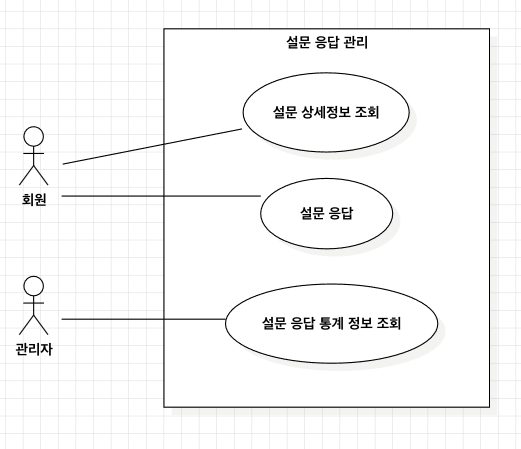

# Use Case Diagrams

---

## 전체 구조도

### Diagram

---

## UC-01, 02, 03 (회원가입, 회원탈퇴, 로그인)

### Diagram

---

## UC-04, 05, 06 (설문 등록, 설문 조회, 설문 검색)

### Diagram

---

## UC-07, 08, 09 (설문 상세정보 조회, 설문 응답, 설문 응답 통계 정보 조회)

### Diagram

---
